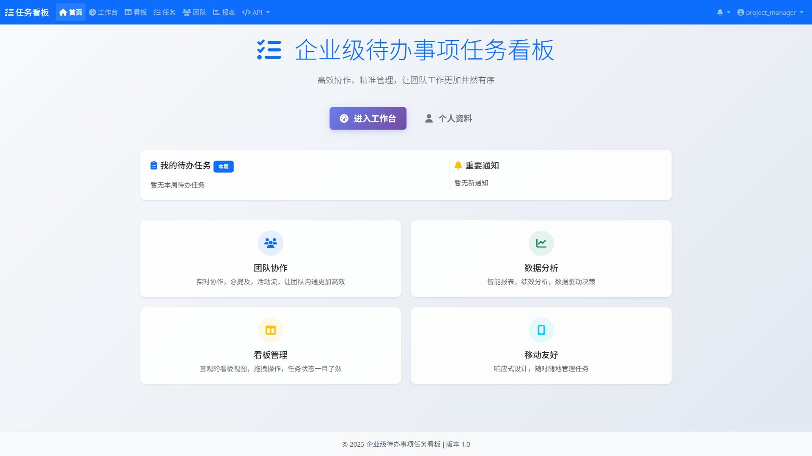
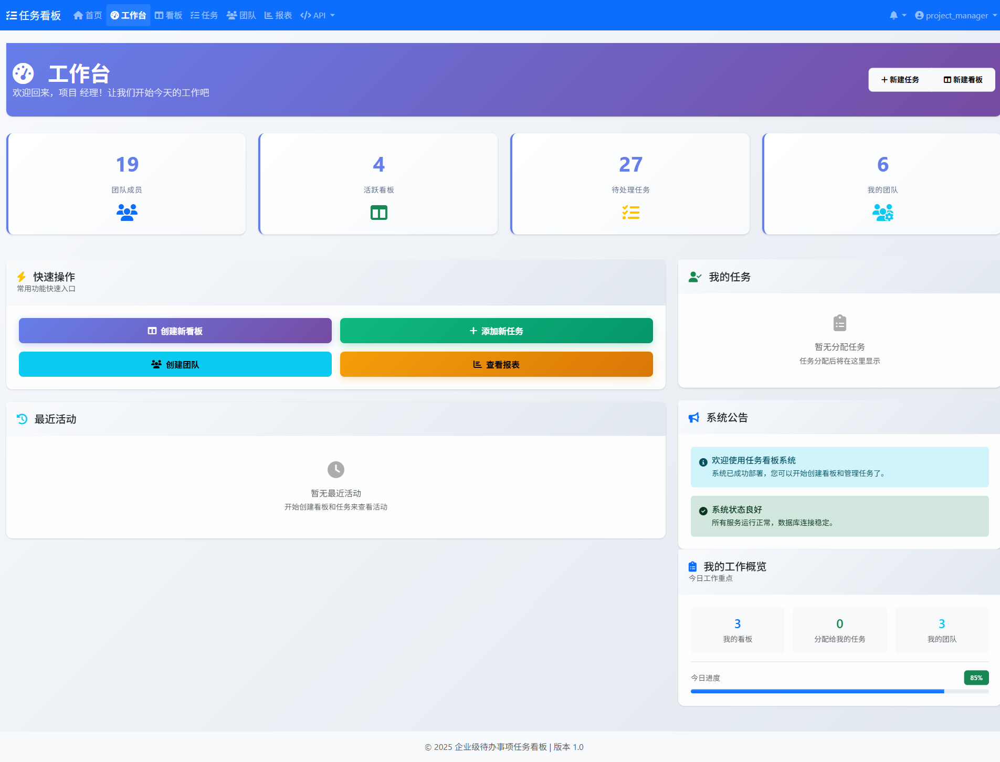
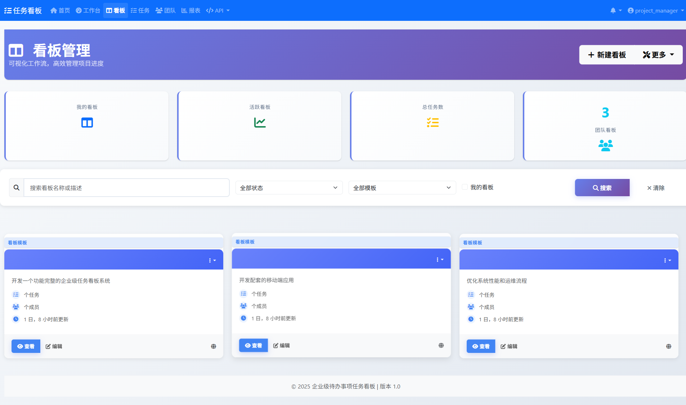
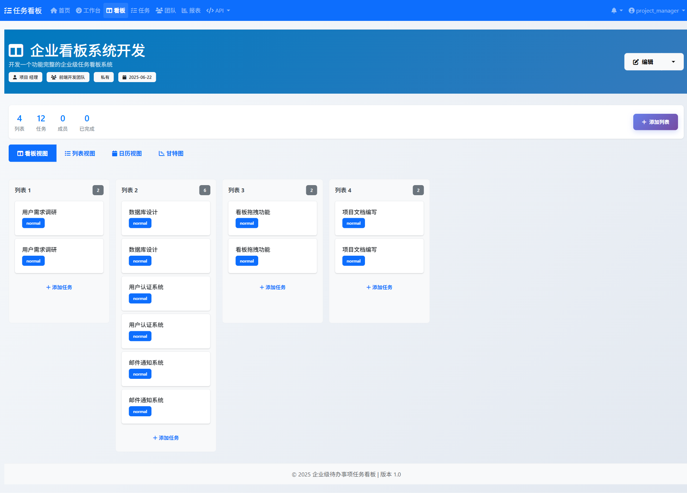
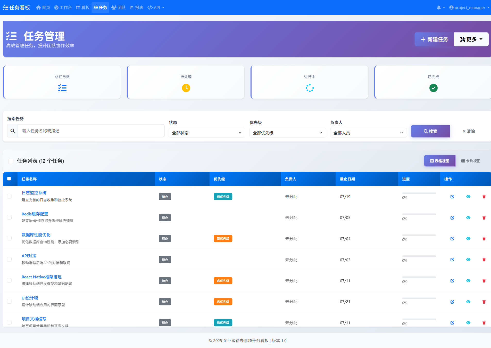
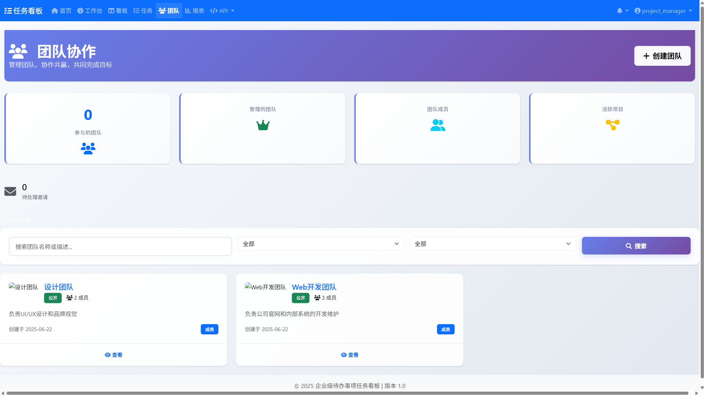
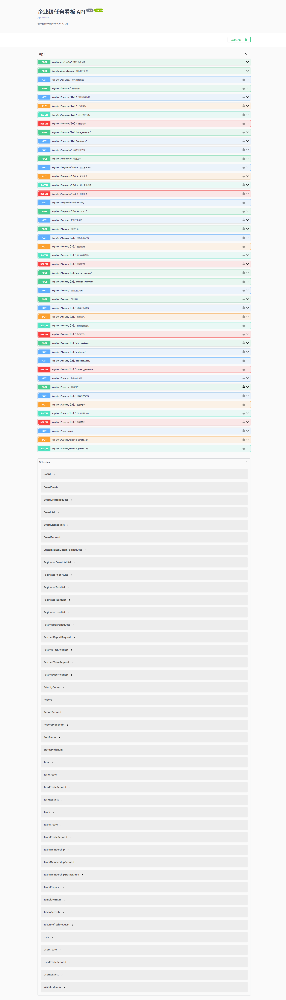
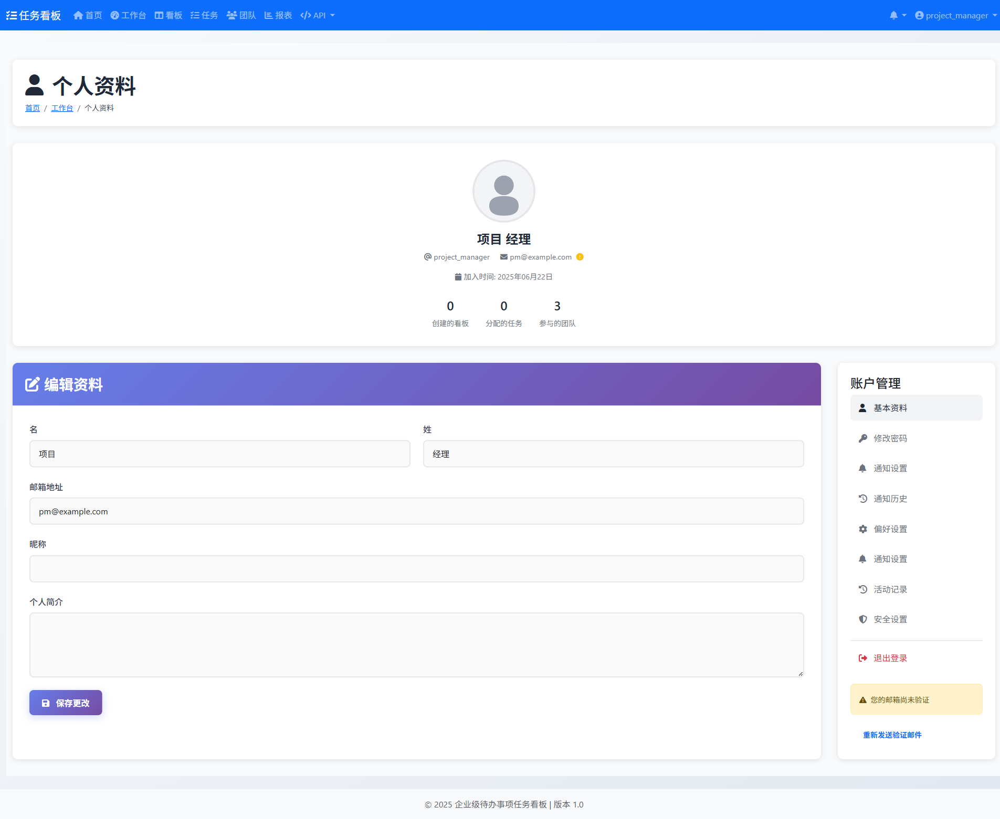

# django5_task_kanban

## 项目简介
本项目是一个基于 Django 5 的任务看板系统，旨在为团队提供敏捷、高效的任务/项目管理解决方案。系统支持任务分组、看板视图、多团队协作、通知提醒、报表分析等多项功能。

## 主要特性
- 灵活的任务管理与看板视图
- 多团队协作支持
- 实时通知与邮件提醒
- 丰富的数据报表与进度追踪
- 模块化设计，方便扩展与二次开发
- 前端用户体验持续优化

## 目录结构简述
- `taskkanban/`：主应用代码，包含核心模块、API、团队、任务、报表等子模块
- `docs/`：项目文档，包含开发计划、环境搭建、功能报告、用例说明等
- `tests/`：测试代码，按功能模块和类型分类
  - `tests/ui/`：UI界面测试
  - `tests/api/`：API接口测试
  - `tests/integration/`：集成测试
  - `tests/unit/`：单元测试
  - `tests/screenshots/`：测试过程中的截图记录
- `tools/`：辅助工具脚本
  - `tools/debug/`：调试工具
  - `tools/fixes/`：修复工具
  - `tools/analysis/`：分析工具
  - `tools/demo/`：演示数据脚本
  - `tools/planning/`：规划和路线图
- `requirements/`：依赖配置
- `docs/`：项目文档，包含开发计划、环境搭建、功能报告、用例说明等

## 快速开始
1. 克隆仓库
   ```shell
   git clone https://github.com/HuangYunfa/django5_task_kanban.git
   ```
2. 参考docs里的开发环境搭建，以及快速启动指南，检查安装依赖，必须
   ```shell
   pip install -r requirements/dev.txt
   ```
3. 数据库迁移，必须
   ```shell
   python manage.py migrate
   ```
4. 启动服务
   ```shell
   docker-compose up -d
   venv\Scripts\activate
   cd taskkanban
   python manage.py runserver
   ```

## 开发与测试

### 测试目录结构
项目采用分层测试架构，测试目录结构如下：

```
tests/
├── ui/          # 🎭 UI自动化测试 (Playwright)
│   ├── conftest.py           # Playwright配置
│   ├── test_full_ui_fixed.py # 全面UI测试
│   ├── test_reports_playwright_enhanced.py # 报表测试
│   └── ...                   # 其他UI测试
├── api/         # 🔌 API接口测试
├── unit/        # 🧪 单元测试
│   ├── boards/               # 看板功能测试
│   ├── reports/              # 报表功能测试
│   ├── users/                # 用户功能测试
│   └── ...                   # 其他单元测试
├── integration/ # 🔗 集成测试
├── archived/    # 📁 已废弃文件归档 (不执行)
├── conftest.py  # pytest全局配置
└── settings.py  # 测试专用设置
```

### 运行测试
项目使用pytest进行测试管理，可通过以下命令运行测试：

运行所有测试:
```shell
pytest
```

运行特定类型的测试:
```shell
pytest tests/ui/          # 运行UI自动化测试 (Playwright)
pytest tests/api/         # 运行API接口测试
pytest tests/unit/        # 运行单元测试
pytest tests/integration/ # 运行集成测试
pytest -m "not slow"      # 排除缓慢的测试
pytest -m "ui"            # 只运行UI测试标记
pytest -m "integration"   # 只运行集成测试标记
```

运行UI自动化测试 (推荐):
```shell
# 一键运行UI测试
run_ui_tests.bat          # Windows批处理脚本

# 或手动运行
cd tests/ui
pytest test_full_ui_fixed.py -v --headed
```

另外，也可以使用Django自带的测试命令：
```shell
cd taskkanban
python manage.py test
```

### 测试用户和数据
为了方便测试，系统提供了以下测试用户：

| 用户名 | 密码 | 角色 | 用途 |
|--------|------|------|------|
| project_manager | 123456 | 项目经理 | UI自动化测试 |
| admin | 123456 | 管理员 | 后台管理测试 |

**注意**: 这些是测试环境专用账号，生产环境请使用强密码。

### 测试报告和截图
- UI测试截图保存在：`tests/ui/screenshots/`
- 测试报告文档位于：`docs/` 目录
- 详细的测试指南：`tests/ui/README.md`

### 工具脚本
项目提供了各种辅助工具脚本，位于tools目录下：
```shell
# 运行分析工具
python -m tools.analysis.check_project_progress

# 运行调试工具
python -m tools.debug.debug_login

# 运行修复工具
python -m tools.fixes.verify_fixes

# 生成演示截图 (需要先启动开发服务器)
python tools/demo/create_screenshots.py

# 优化看板卡片样式并截图
python tools/demo/fix_board_cards_style.py
```

## 文档与资源
- [开发环境搭建文档](https://github.com/HuangYunfa/django5_task_kanban/blob/main/docs/开发环境搭建文档.md)
- [快速启动指南](https://github.com/HuangYunfa/django5_task_kanban/blob/main/docs/快速启动指南.md)
- [API模块开发完成报告](https://github.com/HuangYunfa/django5_task_kanban/blob/main/docs/API模块开发完成报告.md)
- [看板多视图功能完成报告](https://github.com/HuangYunfa/django5_task_kanban/blob/main/docs/看板多视图功能完成报告.md)
- 其余详细文档见 [docs 目录](https://github.com/HuangYunfa/django5_task_kanban/tree/main/docs)

## 参与贡献
欢迎提交 issue 或 PR，一起完善系统功能！

## 产品截图展示

以下是系统主要功能模块的截图展示：

### 首页


### 工作台


### 看板管理


*注: 看板卡片使用了自定义样式，提供更好的用户体验和视觉效果*

### 看板详情


### 任务管理


### 团队管理


### 报表分析


### API文档


### 用户资料


## License
MIT
